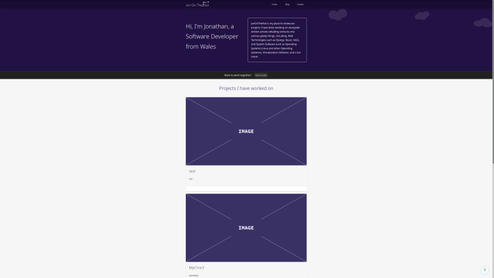

# JonOnTheNet Static Files

This repository houses the static files for my website <a href="https://jononthenet.com">JonOnTheNet</a>. This had been created from a wireframe I had previously created along with small changes added when implementing the Wagtail Content Management System (a snazzy and productive CMS built on Django!).

Initially I was planning to also release the source files for the back end, however, I am not entirely comfortable disclosing details regarding the set-up of the website just in case any exploits are found. Will probably change my mind later depending on how confident I feel about sharing this though.